# Nakyma Project

# About
The Sorting Algorithm Viewer (SAV) is a Java application that implements sorting algorithms, allowing step-by-step visualization of each iteration through graphics represented by asterisks.


> Documentation: [click here](https://gitlab.com/jala-university1/cohort-4/oficial-pt-programa-o-2-cspr-124.ga.t1.25.m1/se-o-c/group-4/docs/-/blob/main/pdfSourceD.pdf?ref_type=heads)


# Features
- Implements the following sorting algorithms:
    - **BubbleSort**
    - **SelectionSort**
    - **QuickSort**
- Step-by-step visualization of each iteration in the form of asterisk graphics.
- Customization via Command-Line Interface (CLI) arguments.

## Usage

Run the program by providing the necessary parameters via the command line.

### Argument Format
```
java Main a=<algorithm> t=<list_type> o=<order> in=<input_type> v="<values>" s=<pause>
```

### Argument Descriptions
| Argument       | Description                                                                                                   |
|----------------|---------------------------------------------------------------------------------------------------------------|
| `a`            | Sorting algorithm (`b` = BubbleSort, `s` = SelectionSort, `q` = QuickSort).                                   |
| `t`            | List type (`n` = numbers, `c` = character).                                                                   |
| `o`            | Order (`az` = ascending, `za` = descending).                                                                  |
| `in`           | Input type (`r` = random, `m` = manual).                                                                      |
| `v`            | Values separated by commas (required if `in=m`), if not put `r=x`, x being the qtd. of numbers to be generated. |
| `s`            | Pause between iterations (in milliseconds).                                                                   |

### Usage Examples

1. **BubbleSort with manual input (ascending):**
   ```bash
   java Main a=b t=n o=az in=m v="4,2,6,0" s=500
   ```
2. **SelectionSort with manual input (descending):**
   ```bash
   java Main a=s t=n o=za in=m v="4,2,6,0" s=500
   ```
3. **QuickSort with random input (descending):**
   ```bash
     java Main a=q t=c o=za in=r r=20 s=100
   ```
## Diagram Classes

```mermaid
classDiagram
direction BT
class Aengus {
  + Aengus() 
  + stopMusic() void
  + adjustVolume(float) void
  + resetPlayer() void
  + resumeMusic() void
  + playMusic(String, int) void
  + pauseMusic() void
   boolean musicPlaying
   boolean musicPaused
}
class Algorithm {
  # Algorithm(AlgorithmConfigs) 
  # SortingGUI visualizer
  - IObserver observer
  - getElementFormated(int) String
  - mapCharToValue(char) int
  # swap(int, int) void
  # notifyObserver() void
  # compare(String, String) boolean
  # displayCurrentList() void
  # displayOriginalList() void
  # displaySortedArray() void
  + displayCurrentState() void
  - randomNumberCount(float, float) int
  + sort(SortingGUI) void
   SortingGUI visualizer
   IObserver observer
}
class AlgorithmConfigs {
  + AlgorithmConfigs(List~String~, String, int, boolean) 
  - boolean isNumeric
  - SortingGUI sortingGUI
  + typeOrder() String
  + skip() int
  + sortingGUI() SortingGUI
  + elements() List~String~
   boolean isNumeric
   SortingGUI sortingGUI
}
class App {
  + App(String[]) 
  + buildAlgorithmConfigs() void
  + implementAlgorithm() void
  + startCLI() void
  + startGUI() void
  + run() void
  - initializeGUI() void
}
class AppConfigs {
  + AppConfigs(String, String, String, String, int, List~String~, int) 
  + typeList() String
  + o() String
  + a() String
  + r() int
  + in() String
  + inputList() List~String~
  + s() int
   String typeListName
   String algorithmName
}
class ArgumentHandler {
  + ArgumentHandler(String[]) 
  + verify() void
  - getOptionalIntArgumentByKey(String, int) int
  - getIntArgumentByKey(String) int
  + createAppConfigs() AppConfigs
  + getArgumentByKey(String) String
}
class AsciiColor {
<<enumeration>>
  - AsciiColor(String) 
  - String code
  + customTextColor(int, int, int) String
  + toEscapeCode() String
  + values() AsciiColor[]
  + randomTextColor() AsciiColor
  + valueOf(String) AsciiColor
  + apply(String) String
  + customBackgroundColor(int, int, int) String
  + applyMultiple(String, AsciiColor[]) String
   String code
}
class BubbleSort {
  + BubbleSort(AlgorithmConfigs) 
  + sort(SortingGUI) void
  - bubbleSort() void
}
class GenerateList {
  + GenerateList() 
  + generate(String, int) String
  - generateNumbers() String
  - makeList() String
  - generateCharacters() String
}
class IArgumentHandler {
<<Interface>>
  + verify() void
  + createAppConfigs() AppConfigs
}
class IObserver {
<<Interface>>
  + update() void
}
class IValidateArguments {
<<Interface>>
  + validateSortingOrder(String) boolean
  + validateSourceListValues(String) boolean
  + validadeQuantityMinimumArgument(String[]) boolean
  + typeListIsCharacter(String) boolean
  + validateIterationTime(String) boolean
  + validateTypeSortAlgorithm(String) boolean
  + validateUserInput(String, String) boolean
  + validateTypeList(String) boolean
  + validateLengthList(String) boolean
}
class IVisionRenderer {
<<Interface>>
  + renderLogo() void
  + clear(int) void
  + renderWelcome() void
  + renderPressStart() void
}
class InputListHandler {
  + InputListHandler() 
  + InputListHandler(String, String) 
  + splitInputList() String[]
  + toCharArray(List~String~) Character[]
  + toIntArray(List~String~) Integer[]
  + handleInput() boolean
  + manipulateItemList(String) boolean
   List~Integer~ asIntegers
   List~String~ asString
}
class Letters {
<<enumeration>>
  + Letters() 
  + count() int
  + values() Letters[]
  + contains(Character) boolean
  + fromValue(Character) Letters
  + valueOf(String) Letters
   Letters random
   Letters[] array
   Character value
}
class Mercury {
  + Mercury() 
  + showMessage(String) void
  + showError(String) void
}
class Numbers {
<<enumeration>>
  - Numbers(int) 
  - int value
  + contains(Integer) boolean
  + count() int
  + valueOf(String) Numbers
  + fromValue(Integer) Numbers
  + values() Numbers[]
   Numbers[] array
   int value
   Numbers random
}
class QuickSort {
  + QuickSort(AlgorithmConfigs) 
  - quickSort(int, int) void
  - partition(int, int) int
  + sort(SortingGUI) void
}
class Rules {
<<enumeration>>
  - Rules(Object) 
  + valueOf(String) Rules
  + values() Rules[]
   String text
   int int
}
class SelectionSort {
  + SelectionSort(AlgorithmConfigs) 
  - selectionSort() void
  + sort(SortingGUI) void
}
class SortingGUI {
  + SortingGUI(List~String~, int) 
  - Algorithm algorithm
  - getNumericValue(String) double
  + startSorting() void
  # paintComponent(Graphics) void
  + updateArray(List~String~, int, int) void
   Algorithm algorithm
}
class SortingObserver {
  + SortingObserver(Algorithm) 
  + update() void
}
class Texts {
<<enumeration>>
  - Texts(String) 
  - String text
  + tableHeader(AppConfigs) String
  + values() Texts[]
  + valueOf(String) Texts
   String text
}
class ValidateHandler {
  + ValidateHandler() 
  + validateTypeSortAlgorithm(String) boolean
  + validateTypeList(String) boolean
  + validateSourceListValues(String) boolean
  + validateUserInput(String, String) boolean
  + typeListIsCharacter(String) boolean
  + validateIterationTime(String) boolean
  + validadeQuantityMinimumArgument(String[]) boolean
  + validateLengthList(String) boolean
  + validateSortingOrder(String) boolean
}
class VisionRenderer {
  + VisionRenderer() 
  - AppConfigs configs
  + renderWelcome() void
  + renderLogo() void
  - buildProgressBar(int, int) String
  + renderProgressBar(int, int) void
  + sleep(int) void
  + renderPressStart() void
  + stopAndPlayMusic(String, int) void
  + playMusic(String, int) void
  + clear(int) void
  + renderHeader() void
  + loading() void
   AppConfigs configs
}

Aengus "1" *--> "mercury 1" Mercury 
Aengus  ..>  Mercury : «create»
Algorithm "1" *--> "observer 1" IObserver 
Algorithm  ..>  Mercury : «create»
Algorithm "1" *--> "mercury 1" Mercury 
Algorithm "1" *--> "visualizer 1" SortingGUI 
AlgorithmConfigs "1" *--> "sortingGUI 1" SortingGUI 
App "1" *--> "algorithm 1" Algorithm 
App  ..>  AlgorithmConfigs : «create»
App "1" *--> "algorithmConfigs 1" AlgorithmConfigs 
App "1" *--> "configs 1" AppConfigs 
App "1" *--> "argumentHandler 1" ArgumentHandler 
App  ..>  ArgumentHandler : «create»
App  ..>  BubbleSort : «create»
App  ..>  Mercury : «create»
App "1" *--> "mercury 1" Mercury 
App  ..>  QuickSort : «create»
App  ..>  SelectionSort : «create»
App  ..>  SortingGUI : «create»
App "1" *--> "sortingGUI 1" SortingGUI 
App  ..>  SortingObserver : «create»
App "1" *--> "vision 1" VisionRenderer 
App  ..>  VisionRenderer : «create»
ArgumentHandler  ..>  AppConfigs : «create»
ArgumentHandler  ..>  GenerateList : «create»
ArgumentHandler "1" *--> "generateList 1" GenerateList 
ArgumentHandler  ..>  IArgumentHandler 
ArgumentHandler  ..>  InputListHandler : «create»
ArgumentHandler "1" *--> "mercury 1" Mercury 
ArgumentHandler  ..>  Mercury : «create»
ArgumentHandler  ..>  ValidateHandler : «create»
ArgumentHandler "1" *--> "validate 1" ValidateHandler 
BubbleSort  -->  Algorithm 
QuickSort  -->  Algorithm 
SelectionSort  -->  Algorithm 
SortingGUI "1" *--> "algorithm 1" Algorithm 
SortingObserver "1" *--> "algorithm 1" Algorithm 
SortingObserver  ..>  IObserver 
ValidateHandler  ..>  IValidateArguments 
ValidateHandler  ..>  InputListHandler : «create»
VisionRenderer "1" *--> "configs 1" AppConfigs 
VisionRenderer  ..>  IVisionRenderer 
VisionRenderer "1" *--> "listHandler 1" InputListHandler 
VisionRenderer  ..>  InputListHandler : «create»
VisionRenderer "1" *--> "mercury 1" Mercury 
VisionRenderer  ..>  Mercury : «create»
```



## 📌 ChangeLog

**[20/02/2025]**
- Added the interface in the terminal

**[27/05/2025]** Mariah Bócoli
- I decoupled the print from the algorithms so that they were only responsible for sorting and created/changed the following files:
- IObserver ➝ Sets the rule for anyone who wants to watch the algorithm.
- SortingObserver ➝ Keeps an eye on the algorithm and shows changes.
- Algorithm ➝ Gets a “phone” to alert anyone listening.
- QuickSort, BubbleSort, SelectionSort ➝ Instead of showing the sorting, it just sorts and notifies the Observer.